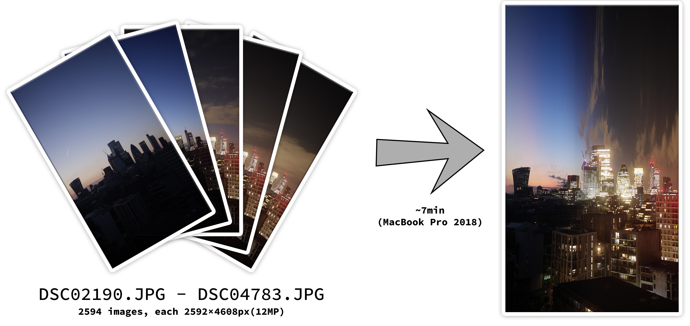
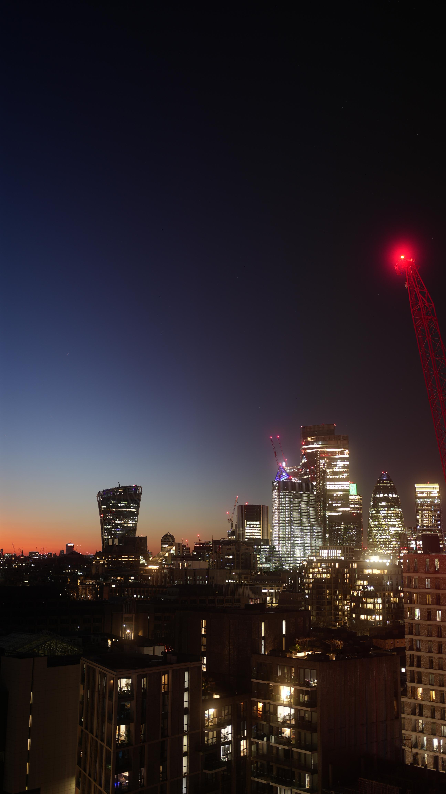
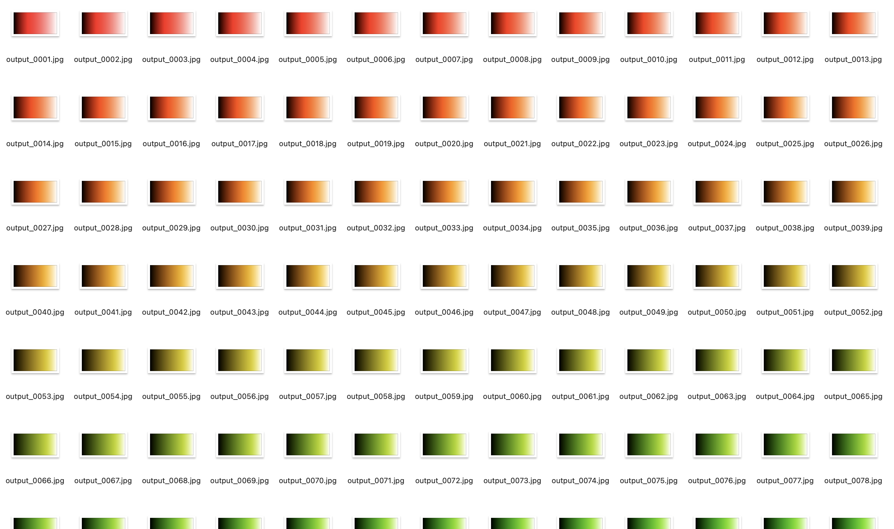

# Time-Lapse Image Creator

This Python program creates a unique visual art piece: a time-lapse image composed from a series of photographs. The program extracts vertical columns of pixels from each input photo and stitches them together to form a final composite image. This innovative approach allows the depiction of the passage of time in a single image.

## Features


🖼️ **Time-Lapse Image Creation**: The program creates a time-lapse image by stitching together vertical columns of pixels from each input photo.

🔄 **Image Rotation**: The program can handle image rotation. If you want to combine images from top to bottom, you can apply a 90º rotation to the images before processing.

🔀 **Reverse Order**: The program allows you to reverse the order of images. This can be useful when you want to depict the time-lapse in reverse chronological order.

🧠 **Memory Profiling**: The program includes a memory profiler that monitors the maximum memory usage. This helps manage memory resources effectively, especially when processing large images.

⚙️ **Flexible Configuration**: The program provides a `config.yaml` file for easy configuration of input and output files, as well as additional options like image rotation and reverse order.

🖼️ **Supports All Image Formats**: The program supports all major image formats for both input and output images. The output format will match the input format.

⚡ **Multi-Threaded CPU**: The program utilizes multiple CPU threads for faster processing. By default, it runs on all available threads up to 12, but you can configure the number of threads according to your system's capabilities.

**Note**: The program will ignore any reflection applied to the input images.

## Gallery

**Contribution welcomed**




The periodic ocean left a repeating pattern of black spikes on the image.

## Installation and Running the Program

1. Clone the repository.
2. Install the required packages by running `pip install -r requirements.txt`.
3. Update the `config.yaml` file according to your needs. The comments in the file explain how its fields correspond to the program's functionality.
4. Run the program by executing `python main.py`.

**Note I**: As this program can be memory intensive due to the processing of large images, it is equipped with a memory profiler that monitors the maximum memory usage. You can take advantage of this by adding `@profile` in front of `process_single_image` in `main.py`, then run `python -m memory_profiler main.py`, like this:
```
@profile
def process_single_image(image, slice_index, slice_width, is_horizontal):
```

**Note II**: By default, the program utilizes all available CPU threads up to 12 threads. If you want to change this, you can edit the following line in `main.py`:
```
    with ThreadPoolExecutor(max_workers=12) as executor:
```

## Configuration

The configurations for input and output files, as well as additional options, are stored in the `config.yaml` file.

```
# Configuration for the time-lapse image creation program

input:
  dir: "./test_imgs/"  # Directory where the input images are stored
  file_prefix: "output_"  # Prefix of the input image files
  file_number_digit_length: 4  # Number of digits in the file number
  file_begin_digit: 1  # Starting number of the image files
  file_end_digit: 360  # Ending number of the image files
  file_suffix: "JPG"  # File extension of the image files

  # the default config will load image ./test_imgs/output_0001.JPG to ./test_imgs/output_0360.JPG 

output:
  dir: "./output/"  # Directory where the output image will be saved

options:
  is_reversed: False  # Option to reverse the order of the images
```

**Note**: The output format will match the input format, so .JPG will result in a .JPG file

## Example


The repository includes test images that correspond to the default YAML configurations. You can run the code directly to generate a time-lapse image. The expected result is shown below:

